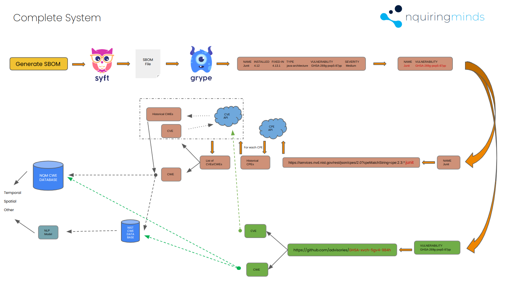

# Vulnerability analisys tools

## These methods may change as the project progresses.

1. ### Please download the input folder and place it in the vulnerability-analisis-tools module:

   - Input directory can be downloaded from [here](https://drive.google.com/file/d/1ZMkhTns-AoLhxtAgQsrHxHtBQi-69bDy/view?usp=sharing). This also contains all the (National Vulnerability Database)[NVD](https://nvd.nist.gov/) CPE/CVE/CWE data. (recommended)

---

2. ### Install [syft](https://github.com/anchore/syft/tree/main), [grype](https://github.com/anchore/grype/blob/main/README.md) and [CCScanner](https://github.com/lkpsg/ccscanner) on your machine

---

3. ### Download the Git Advisory Database from [here](https://github.com/github/advisory-database) and update the path in `get-git-ghsas.mjs` line 19 with with your local advisory-database/advisories path.

---

### Command Line Tool Usage

```js
nqmvul - help;
```

Presents the list of commands

```js
nqmvul -getCPEs <path_to_sbom.json>
```

The -getCpes flag will parse an SBOM and return a list of CPEs in the 2.3 format.

```js
nqmvul -listCPEs <path_to_sbom.json>
```

The -listCpes flag will parse an SBOM and return detailed information about each CPE, such as CVEs and CWEs

```js
nqmvul -getCVEs <CPE>
```

The -listCVEs will return the known CVEs and CWS for a CPE. The CPE must be in CPE2.3 format e.g. "cpe:2.3:a:busybox:busybox:1.33.2"

```js
nqmvul -writeCVEs <path_to_sbom.json>
```

The -writeCVEs flag will write all the CVE data of an sbom into a json format to input/cveData.json

```js
nqmvul -getHistoricalCpes <CPE>
```

The -getHistoricalCpes flag will return all known versions of the input CPE. The CPE must be in CPE2.3 format e.g. "cpe:2.3:a:busybox:busybox:1.33.2"

```js
nqmvul -getHistoricalCves <CVE>
```

The -getHistoricalCves flag will return all known versions of the input CVE. Supported CVE format: "CVE-2022-48174"

```js
nqmvul -getCweInfo <CWE,CWE,...>
```

The -getCweInfo flag will return information such as description for each CWE. The CWEs must be writen without any space e.g. 'CWE-476,CWE-681'

```js
nqmvul -generateSbom <project_path> <project_name>
```

The -generateSbom flag will generate an SBOM and a vulnerability report for a project. SBOM is saved to /input/sboms/project_name.json. Vulnerability report is saved to /input/reports/vulnerability-report-project_name. Syft and Grype must be installed to run this command

```js
nqmvul -listVulnerabilities <path_to_vulnerability_report>
```

The -listVunlerabilities flag will list all vulnerabilities previously detected by [grype](https://github.com/anchore/grype/blob/main/README.md)

```js
nqmvul -genDep <ccScanner_path> <cpp_project> <project_name> <python_env_path>
```

- The first argument should be the absolute path to the ccScanner installation directory.
- cpp_project should represent any C/C++ project you wish to scan.
- The project_name is utilised to save the extracted dependency list as /input/ccsDependencies/project_name_dependencies.
- In case your ccScanner installation requires a specific Python environment, ensure you provide the absolute path to python/env/bin. Currently, only the Python venv environment is supported.

```js
nqmvul -generateConan <project_name>
```

The -generateConan flag will generate a conanfile.txt for that project. ccsDependencies/projec_name_dependencies must exist before running this command. The dependency file is created by ussing the `-genDep` flag.

```js
nqmvul -mapCpes <project_name>
```

The -mapCpes will create a list of known cpes for each dependency in /input/ccsDependencies/project_name_dependencies and save them to input/cpes/cpeMapping.json.

```js
nqmvul -dummySbom <project_name> <sbom_type>
```

The -dummySbom flag can be used to generate a dummy SBOM. It takes two arguments, the project name and format(only json or xml). Please ensure that /input/conan-files/<project_name>/conanfile.txt and /input/cpe_data.csv exists before running the command.

```js
nqmvul -getGhsa <GHSA-vulnerability>
```

The -getGhsa flag will return detailed information about a known GHSA vulnerability. Please ensure the GHSA vul is valid and maches the following format e.g GHSA-j8xg-fqg3-53r7.

```js
nqmvul -extractGhsas <path_to_vulnerability_report>
```

The -extractGhsas will return an array of GHSA codes. Before running this command please replace the `ghsaDatabase` path from `get-git-ghsas.mjs` line 19 with with your local advisory-database/advisories path.

---

#### identify_cpe.mjs/` get_cpes(filePath)` and get-syft-cpes.mjs/ `get_cpes(filePath)`

         have the same functionality of parsing an SBOM and returning a list of CPEs in the following format:
        ['cpe:2.3:a:remapping:remapping:2.2.1:*:*:*:*:*:*:*',
        'cpe:2.3:a:code-frame:code-frame:7.12.11:*:*:*:*:*:*:*',
        ...]

These methods may become obsolete if we choose to use the methodology outlined below:

[Syft](https://github.com/anchore/syft/tree/main)
[Grype](https://github.com/anchore/grype/blob/main/README.md)

---

### list-vulnerabilities.mjs

```javascript
    /** returns a list of CVEs based on a CPE name.*/
    export async function fetchCVEsForCPE(cpeName)

    /** Takes as argument either the path to an SBOM or the json data itself. Returns the coresponding CVEs of each CPE */
    export async function fetchCVEsWithRateLimit(sbomPath)

    /** Takes as argument either the path to an SBOM or the json data itself. Writes the CVE data to /input/cveData.json */
    export async function writeCvesToFile(sbomPath)

    /** As the API is limited we also save the CVE data to input/cveData.json for later use.*/
```

---

### get-historical-cves.mjs

```javascript
     /** Returns an array of historical CVEs basedon a CVE id.*/
    export async function fetchHistoricalCVEs(cveId)
```

---

### get-historical-cpes.mjs

```javascript
     /** Returns an array of historical CPEs basedon a CPE id.*/
    export async function fetchHistoricalCPEs(cpeId)
```

---

### generate_sbom.mjs

```javascript
    /** directoryPath can be pointed at any of the following ecosystems
        Alpmdb
        apkdb
        binary
        cocoapods
        Conan (c,c++ package manager)
        dartlang-lock
        dotnet-deps
        dpkgdb
        elixir-mix-lock
        erlang-rebar-lock
        go-mod-file
        go-module-binary
        graalvm-native-image
        haskell
        java
        java-gradle-lockfile
        java-pom
        javascript-lock
        linux-kernel
        nix-store
        php-composer-lock
        portage
        python-index
        python-package
        rpm-db
        rpm-file
        ruby-gemfile
        rust-cargo-lock
        sbom
        Swift-package-manager
    and will create an cycloneDx json input/SBOMfile and also a input/reports/vulnerability_report_fileName */
    export function generateVulnerabilityReport(directoryPath, fileName)
```

---

### get-grype-vulnerabilities.mjs

```javascript
     /** This function takes as a parameter text data or the path to a vulnerability report file generated by grype in .*/ generateVulnerabilityReport(directoryPath, fileName).
    export function getVulnerabilities(filePath)
    /** Returns an Array of objects:  Array<{
                                             name: string;
                                             installed: string;
                                             fixedIn: string;
                                             type: string;
                                             vulnerability: string  (CVE, GHSA, ...);
                                             severity: string;
                                            },
                                            ...
                                            >*/
```

### get-CWEs-info.mjs

```javascript
     /** This function takes as a parameter a list of CWEs ["CWE-476", "CWE-681"].*/
    export function getCweInfo(cwes)
    /** Returns an Array of objects:  Array<  {
                                                'CWE-ID': '476',
                                                Name: 'NULL Pointer Dereference',
                                                Description: 'A NULL pointer dereference ..',
                                                Extended_Description: 'NULL pointer dereference ...',
                                                Alternate_Terms: [ 'NPD', 'null deref', ..],
                                                Likelihood_Of_Exploit: 'Medium',
                                                Common_Consequences: [ [Object], [Object] ],
                                                Related_Weaknesses: [ [Object], [Object], [Object] ]
                                            },
                                            ...
                                            >*/
```

### generate-dep-list.mjs

```javascript
// usage example
const ccScannerPath = "~/path/to/ccscanner/ccscanner";
const cppDierectory = "~/path/to/cpp_repository";
const projectName = "repository_name";
const envPath = "~/path/to/python_evironment/bin";

generateDependencyList(ccScannerPath, cppDierectory, projectName, envPath);

/**
 * Supports only python3 venv environment.
 * If you are using a python environment add the path to that environment, otherwise just add N/A.
 * Runs the CCScanner cli tool with the parameters as commands and will create a json list of dependencies in input/ccsDependencies/
 */
```

### generate-conan-text-from-json.mjs

```javascript
/**
 * Takes as a parameter a projecs name. Example: for ccsDependencies/edgesec_dependencies pass in generateConanFile(edgesec).
 * It will scan ccsDependency directory for the respective json file and extract all the dependencies into a conanfile.txt
 *
*/
    export function generateConanFile(projectName)
```

### get-cpes-from-dependency.mjs

```javascript
/**
 * Usage example
 *  const projectName = 'edgesec'
 *  mapCPEs(projectName);
 *
 * "openssl:3": [
    "cpe:/a:openssl:openssl:3.0.0",
    "cpe:/a:openssl:openssl:3.0.0:alpha1",
    "cpe:/a:openssl:openssl:3.0.0:alpha10",
    ...]
 *
 * For each dependency returns a list of cpes
 * Dependent of cpe_data.csv
*/
export async function mapCPEs(projectName)

```

### get-bom-from-cpes.mjs

```javascript
/**
 * Usage example
 * const projectName = 'edgesec'
 * const bomFormat = 'json' or 'xml'
 * generateDummySBOM(projectName);
 *
 * Returns a bom for a list of dependencies. Currently supports only json or xml types
*/
export async function generateDummySBOM(projectName, bomFormat)

```

### get-git-ghsas.mjs

```javascript
/**
 * Returns a json object with detailed information about a GHSA vulnerability
*/
export async function getGHSAInfo(ghsa)
/**
 * Returns a list of GHSA codes given a Grype vulnerability report
*/
export async function processVulnerabilities(vulReport)

```
